#+TITLE: Energy Optimization System of Electric Vehicles
#+SUBTITLE: Real-world deep reinforcement learning for EV energy efficiency
#+AUTHOR: Binjian Xin
#+EMAIL: xinbinjian.in@siasun.com
#+DATE: \today
#+LANGUAGE: en
#+STARTUP: beamer
#+LATEX_CLASS: beamer
#+LATEX_CLASS_OPTIONS: [aspectratio=169,professionalfonts]
#+OPTIONS: H:2 toc:nil num:nil ^:t
#+BEAMER_THEME: Madrid
#+BEAMER_COLOR_THEME: default
#+BEAMER_FONT_THEME: professionalfonts
#+COLUMNS: %40ITEM %10BEAMER_env(Env) %9BEAMER_envargs(Env Args) %4BEAMER_col(Col) %10BEAMER_extra(Extra)
#+LATEX_HEADER: \usepackage{booktabs}
#+LATEX_HEADER: \usepackage{amsmath,amssymb}
#+LATEX_HEADER: \usepackage{graphicx}
#+LATEX_HEADER: \setbeamertemplate{navigation symbols}{}
#+LATEX_HEADER: \setbeamertemplate{caption}[numbered]
#+LATEX_HEADER: \AtBeginSection[]{\begin{frame}<beamer>{Roadmap}\tableofcontents[currentsection]\end{frame}}

* Talk Map

** Thirty-minute structure

| Part | Topic | Time |
|---+---+---|
| 1 | Problem and design principle | 5 min |
| 2 | EOSEV formulation and system | 9 min |
| 3 | Real-vehicle experiments | 12 min |
| 4 | Discussion and deployment | 4 min |

** Main claim

EOSEV improves battery electric vehicle energy efficiency by learning
bounded pedal-map updates from real driving data.

- Uses directly measurable signals: speed, accelerator, brake, voltage,
  current
- Keeps the driver and production VCU in the loop
- Learns from measured energy consumption instead of shaped simulation
  rewards
- Shows about $7\%\sim8\%$ weekly block-level energy reduction on a
  public-road route

* Motivation

** Why energy optimization is still hard

- Same vehicle and route can have different energy consumption
- Longitudinal behavior dominates short-horizon energy demand
- Real EV operation is noisy, partially observed, and non-repeatable
- Simulation is incomplete for driver, traffic, road, and powertrain
  details

\vspace{0.5em}

At $50\,\mathrm{km/h}$, a representative $2500\,\mathrm{kg}$ EV needs:

- About $3.4\,\mathrm{kW}$ for rolling resistance
- About $1.0\,\mathrm{kW}$ for aerodynamic drag
- About $17.4\,\mathrm{kW}$ for $0.5\,\mathrm{m/s^2}$ acceleration,
  before drivetrain losses

** Gap in existing DRL eco-driving work

- Many studies rely on simulation, connected traffic assumptions, or
  autonomous speed planning
- Rewards often mix weighted fuel, electricity, comfort, and constraint
  terms
- Real-time deployment and hard production constraints are often
  secondary
- Generalization across routes, weather, and driving style remains weak

\vspace{0.5em}

EOSEV focuses on a narrower but production-relevant question:

#+begin_quote
Can an agent adapt the powertrain response using only signals already
available from the vehicle?
#+end_quote

* EOSEV Formulation

** Driver-in-the-loop control

Without the agent, the driver controls speed through accelerator and
brake pedals, and the VCU maps pedal opening and speed to torque.

With EOSEV:

- The agent observes driver and vehicle signals
- The agent outputs a bounded torque-map increment
- The VCU remains the final authority for calibrated limits and safety

\vspace{0.8em}

\[
\Delta\tau = \pi_\theta(V, A, B)
\]

** Markov decision process

| Element | EOSEV design |
|---+---|
| State | $s_t = (V_t, A_t, B_t)$ |
| Action | $\Delta\tau_t$, bounded torque-request update |
| Reward | $r_t = -U_t I_t T_s$ |
| Environment | Vehicle, road, traffic, and driver |
| Policy | Actor network used online |

\vspace{0.5em}

Measured voltage and current make the reward directly tied to consumed
electric work.

** Action: modify the pedal map

*** Initial map :BMCOL:
:PROPERTIES:
:BEAMER_col: 0.48
:END:

#+ATTR_LATEX: :width 0.92\textwidth
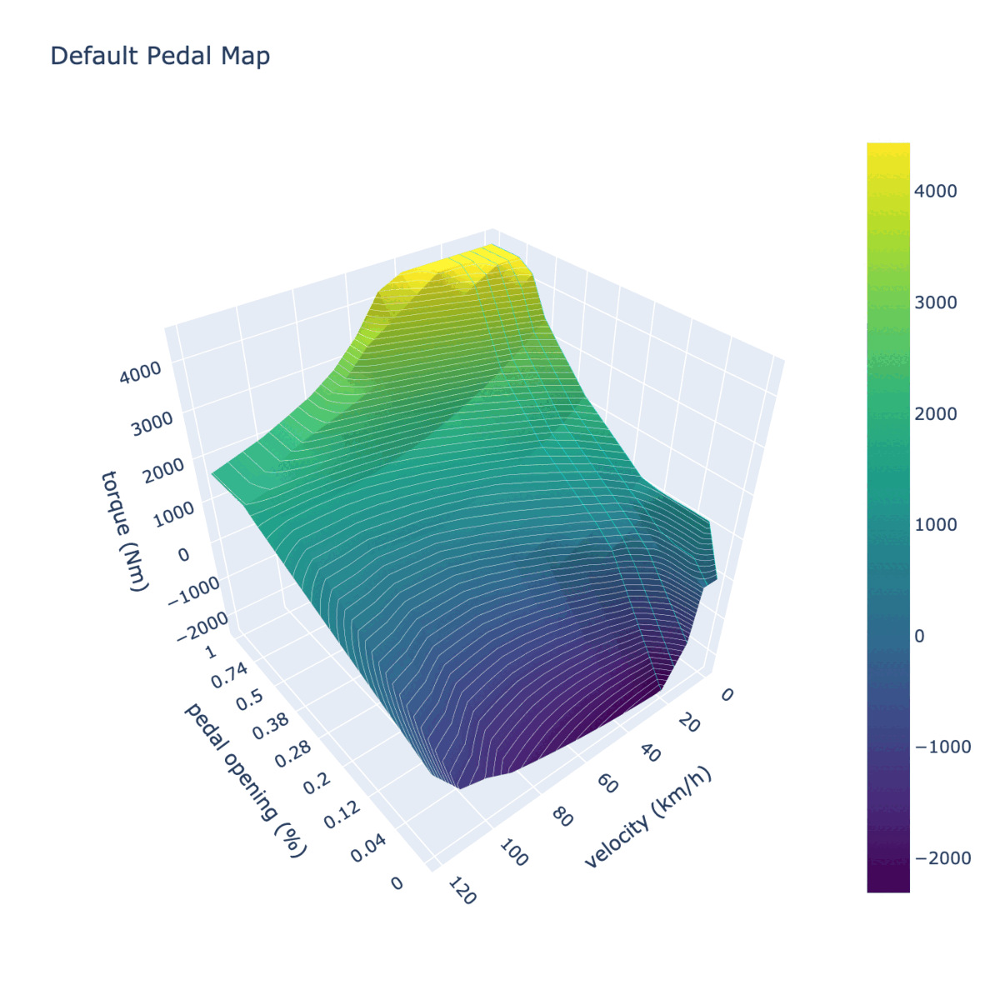

*** Learned map :BMCOL:
:PROPERTIES:
:BEAMER_col: 0.48
:END:

#+ATTR_LATEX: :width 0.92\textwidth
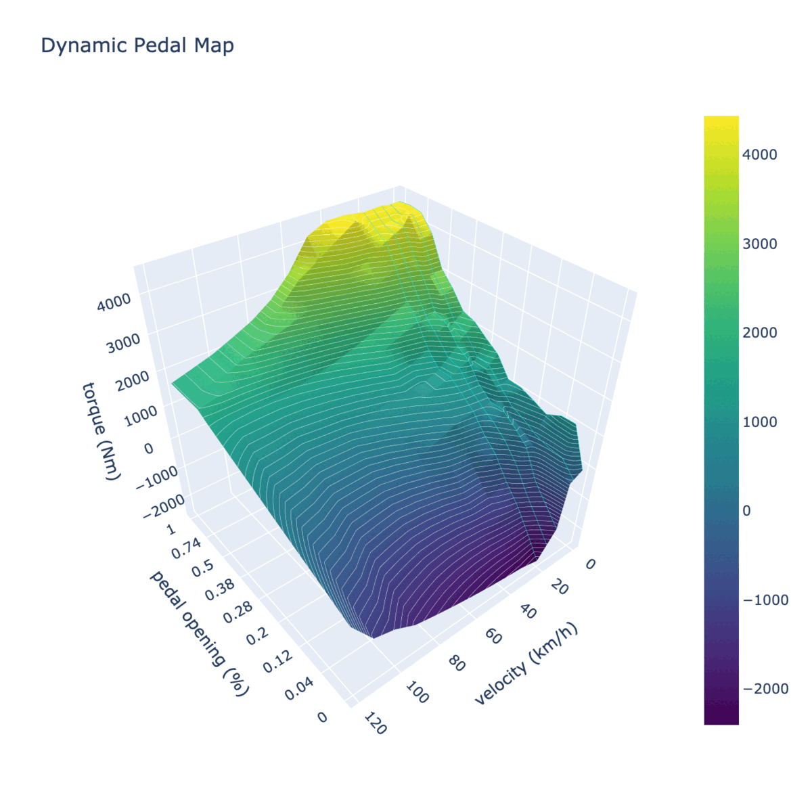

** Why this action is practical

- Uses a production control interface: pedal map update
- Supports range checks before deployment
- Preserves torque, voltage, current, thermal, diagnostic, and
  drivability safeguards
- Allows fallback to nominal map if the model or data path fails
- Keeps the driver in control of the vehicle

* Algorithm and System

** DDPG training loop

EOSEV uses a customized Deep Deterministic Policy Gradient setup.

- Actor: maps state to bounded $\Delta\tau$
- Critic: evaluates state-action pairs during training
- Replay buffer: stores $(s_t, a_t, r_t, s'_t)$ records
- Training: update actor and critic after each episode
- Inference: actor only

#+ATTR_LATEX: :width 0.38\textwidth
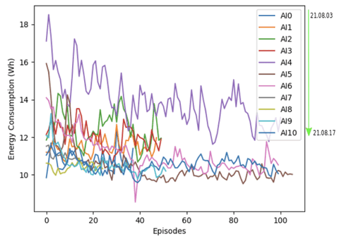

** Network role separation

*** Critic in training :BMCOL:
:PROPERTIES:
:BEAMER_col: 0.52
:END:

#+ATTR_LATEX: :width \textwidth
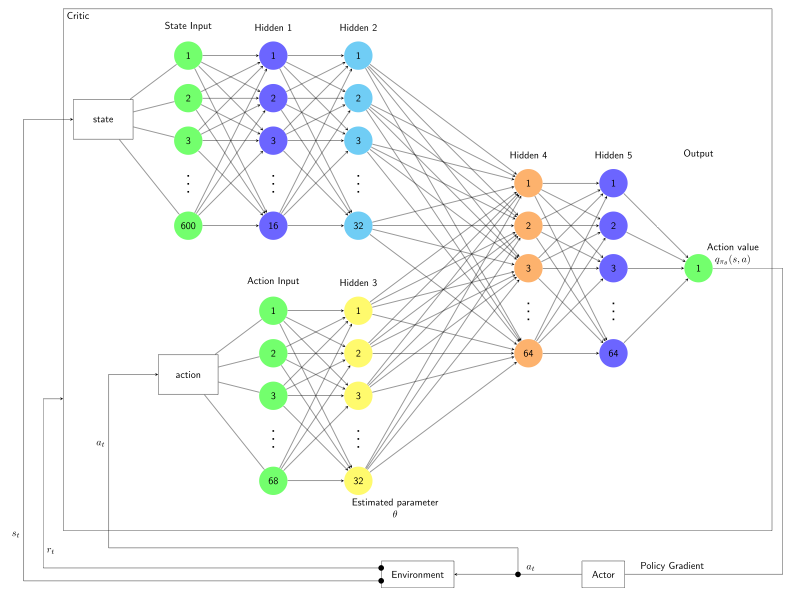

*** Actor in inference :BMCOL:
:PROPERTIES:
:BEAMER_col: 0.42
:END:

#+ATTR_LATEX: :width \textwidth
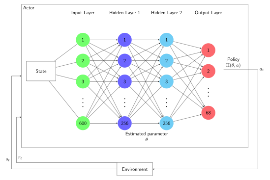

** Data record and replay buffer

Each timestamped record stores an experience tuple:

\[
(t, s_t, a_t, r_t, s'_t)
\]

\[
s_t=(V_t,A_t,B_t), \quad r_t=-U_tI_tT_s
\]

- Sensor streams must be synchronized before training
- Episodes provide a meaningful energy-consumption comparison unit
- Low-density records are suitable for cloud upload and fleet-scale
  offline learning

** Deployment dataflow

EOSEV supports cloud training, local training, and on-board inference.

- Scheduler configures dataflow states
- Cruncher receives observations and forwards them to the Agent
- Storage writes synchronized time-series records
- Agent returns updated pedal maps or actor outputs
- OTA can distribute validated model and map updates

\vspace{0.8em}

| Vehicle/ECU | -> | Cruncher | -> | Agent |
| Storage | <- | synchronized records | <- | Replay buffer |
| OTA update | <- | validated model/map | <- | Cloud training |

* Experiments

** Proving-ground training setup

- Fixed vehicle, driver, route, and speed profile
- Vehicle accelerates from standstill to about $17\,\mathrm{km/h}$ and
  decelerates back to standstill
- Episodes are discarded if speed remains outside the allowed band for
  more than three seconds
- Each three-hour run contains about 60 episodes
- Training reloads previous model weights and pedal map

#+ATTR_LATEX: :width 0.40\textwidth
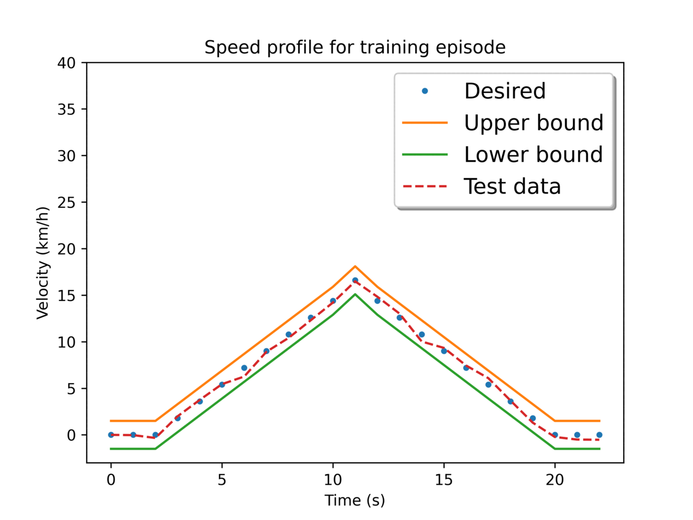

** Driving-style monitoring

Driving style is represented by the pedal-opening distribution.

*** Baseline distribution :BMCOL:
:PROPERTIES:
:BEAMER_col: 0.42
:END:

#+ATTR_LATEX: :width \textwidth
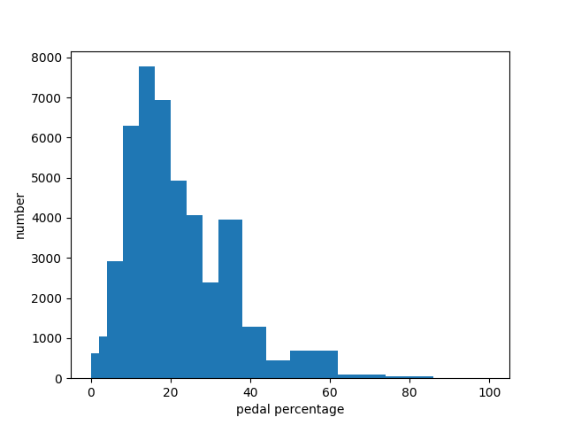

*** KL divergence :BMCOL:
:PROPERTIES:
:BEAMER_col: 0.52
:END:

#+ATTR_LATEX: :width \textwidth
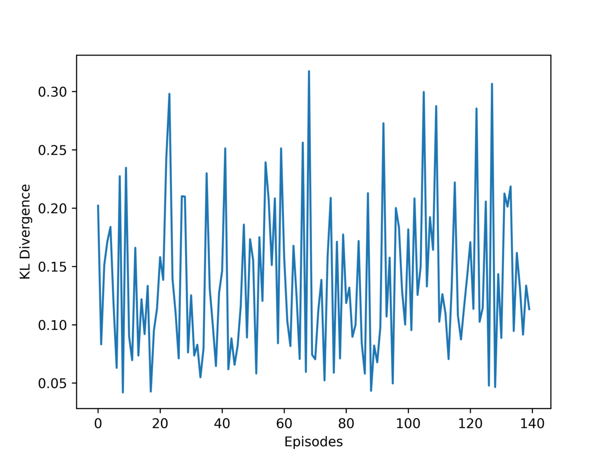

** Proving-ground result

- Energy consumption decreases within and across runs
- Learned map requests larger negative torque at low speed and small
  pedal opening
- Regenerative braking is exploited implicitly through reward-driven
  map updates

#+ATTR_LATEX: :width 0.55\textwidth

** Public-road route 1

*** Route :BMCOL:
:PROPERTIES:
:BEAMER_col: 0.44
:END:

#+ATTR_LATEX: :width \textwidth
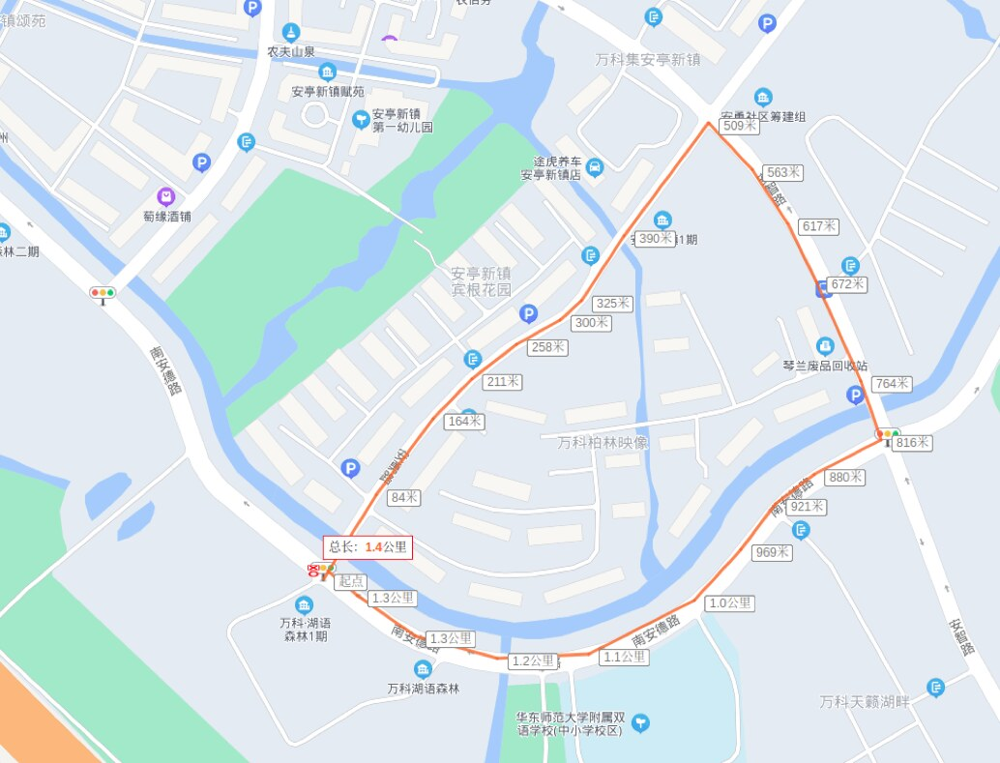

*** Speed profile :BMCOL:
:PROPERTIES:
:BEAMER_col: 0.52
:END:

#+ATTR_LATEX: :width \textwidth
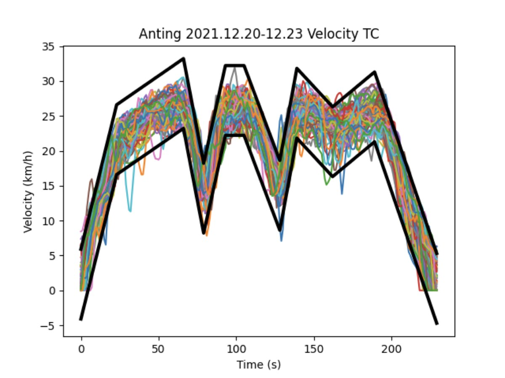

** Public-road route 1 result

*** Energy consumption :BMCOL:
:PROPERTIES:
:BEAMER_col: 0.52
:END:

#+ATTR_LATEX: :width \textwidth
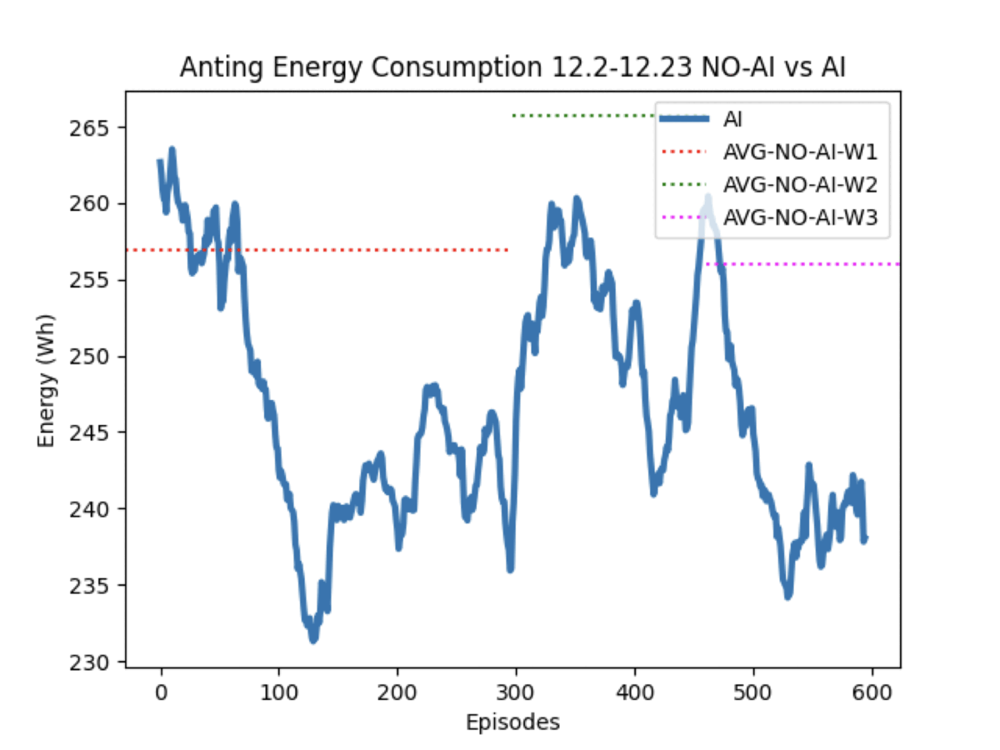

*** Weekly comparison :BMCOL:
:PROPERTIES:
:BEAMER_col: 0.42
:END:

- Week 1: 8.16% reduction
- Week 2: 7.56% reduction
- Week 3: 7.03% reduction
- Mean: $7.58\%\pm0.57\%$

** Route 1 driving-style drift

The public-road run spans about 600 episodes, so style drift becomes
visible.

#+ATTR_LATEX: :width 0.38\textwidth
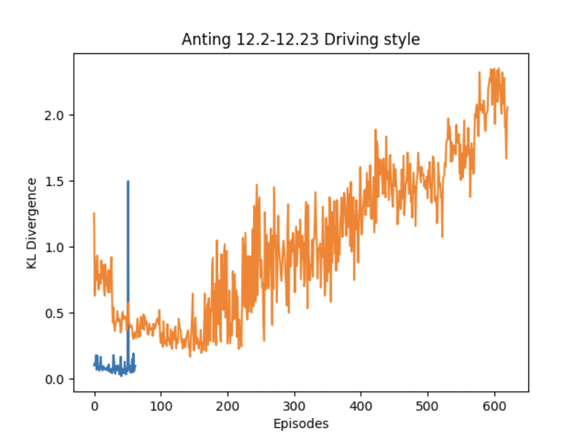

- Longer tests require drift monitoring
- Online training can adapt to changing driver behavior
- Comparing same-week baselines helps control for weather and battery
  heating effects

** Transfer to route 2

*** Route and speed :BMCOL:
:PROPERTIES:
:BEAMER_col: 0.52
:END:

#+ATTR_LATEX: :width 0.82\textwidth
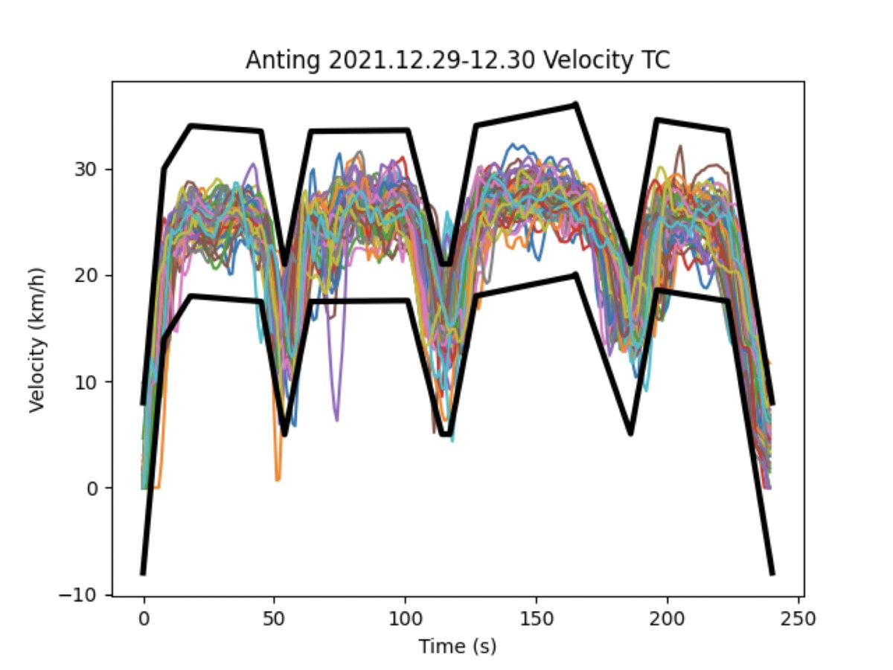

*** Result :BMCOL:
:PROPERTIES:
:BEAMER_col: 0.44
:END:

#+ATTR_LATEX: :width 0.82\textwidth
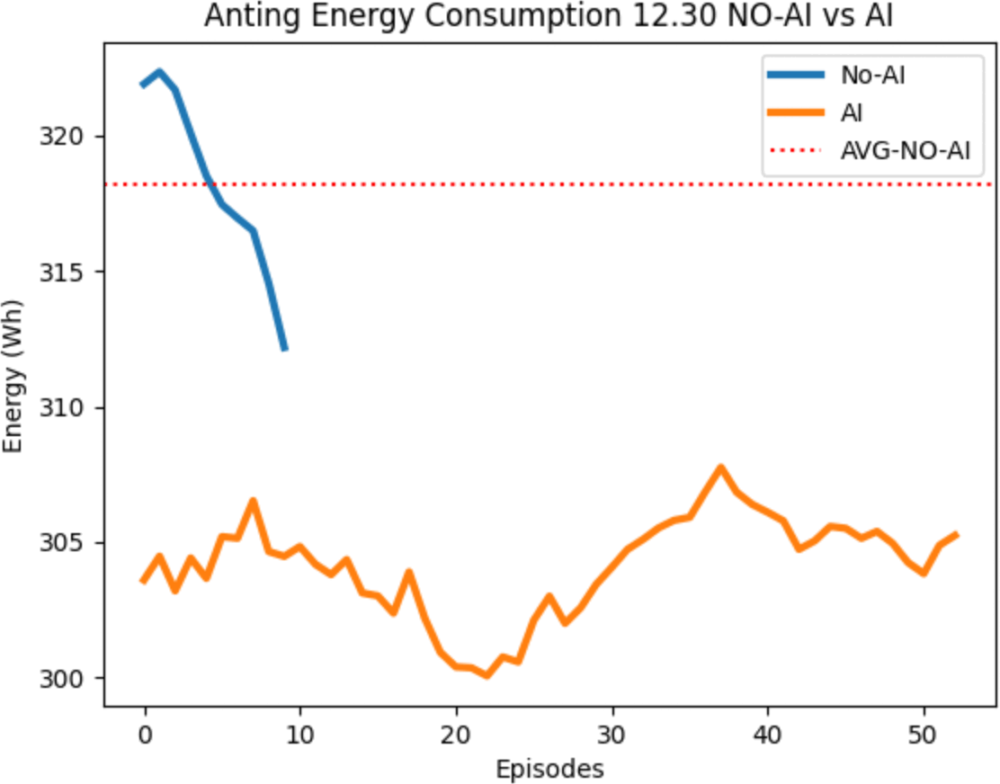

- Frozen route-1 model
- Different speed profile
- About 4% reduction without fine-tuning

** Multimodal road scenarios

Traffic lights and pedestrians create multiple modes. The experiment
tags halt/non-halt states at three right turns, yielding eight modes.

*** No halt mode :BMCOL:
:PROPERTIES:
:BEAMER_col: 0.48
:END:

#+ATTR_LATEX: :width 0.82\textwidth
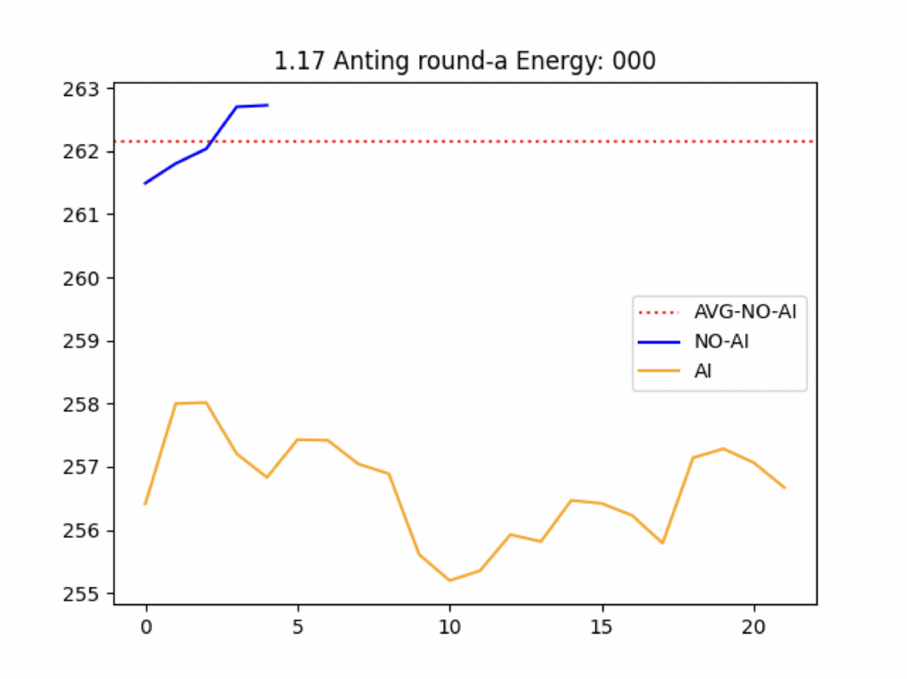

Average reduction: 9.5%

*** Halt at all turns :BMCOL:
:PROPERTIES:
:BEAMER_col: 0.48
:END:

#+ATTR_LATEX: :width 0.82\textwidth
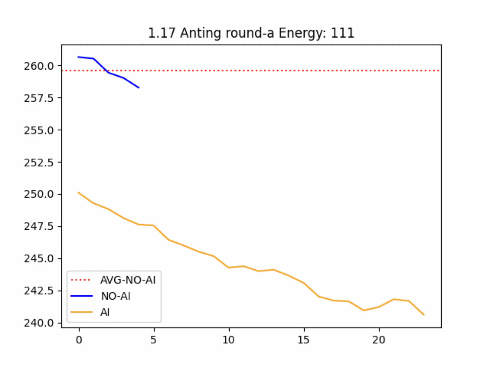

Average reduction: 4.3%

** What the experiments show

- Real reward-driven learning can be sample efficient when the MDP is
  tightly scoped
- Energy reduction emerges without hand-coded regenerative-braking rules
- Frozen transfer works, but online adaptation gives stronger route
  performance
- Multimodal public-road behavior can be handled without manual scenario
  policies
- Driving-style drift must be measured, not assumed away

* Discussion

** Deployment constraints

Production deployment should include:

- Timestamped observations and bounded queues
- Watchdog fallback to nominal pedal map
- Stale-action rejection
- Range-checked map updates
- ECU or companion-processor latency budget
- OTA validation before fleet rollout

\vspace{0.5em}

Cloud training is useful for fleet-scale updates; on-board inference is
preferred under strict latency requirements.

** Limitations and future work

- Current observation window is too short for ramps and topographic
  changes
- Driving style is non-stationary over long windows
- Recurrent policies can improve partial observability, but require more
  data and memory
- Offline RL can use uploaded fleet records for broader training
- Diffusion policies may model multimodal behavior, but denoising steps
  are challenging for real-time control

** Takeaways

1. EOSEV keeps the production driver-in-the-loop architecture.
2. The reward is measured electric work, not a fragile shaped proxy.
3. Bounded pedal-map updates create a practical action interface.
4. Real-road tests show about $7\%\sim8\%$ weekly block-level reduction.
5. Scaling requires drift monitoring, transfer validation, and fleet-data
   learning.

